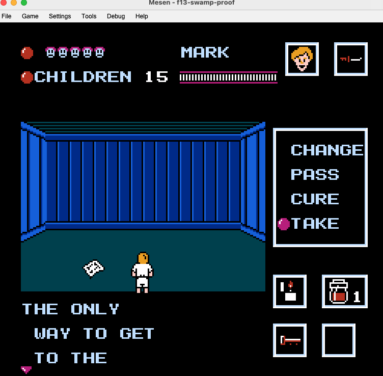
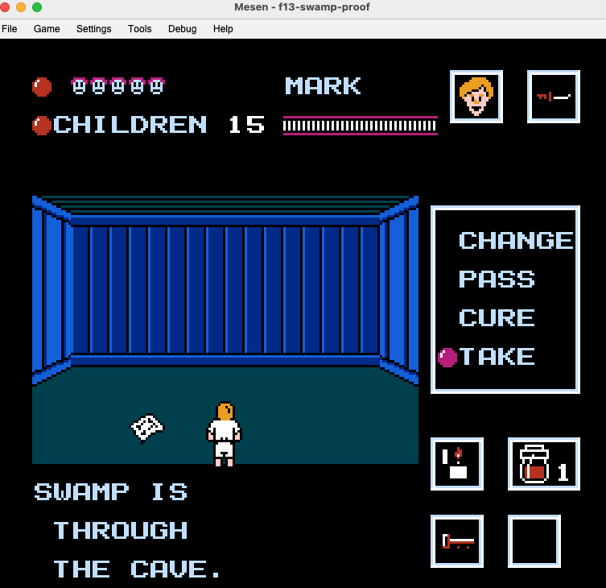
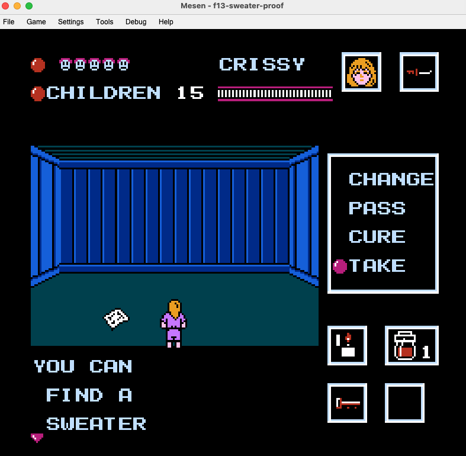
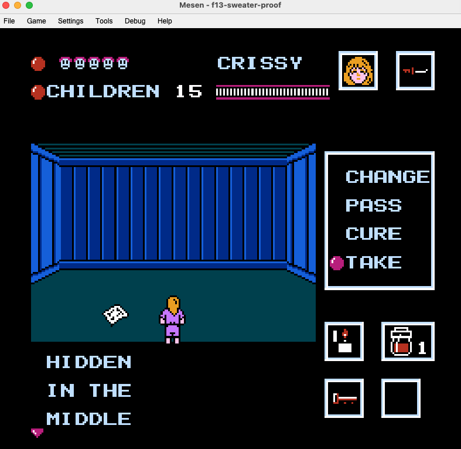
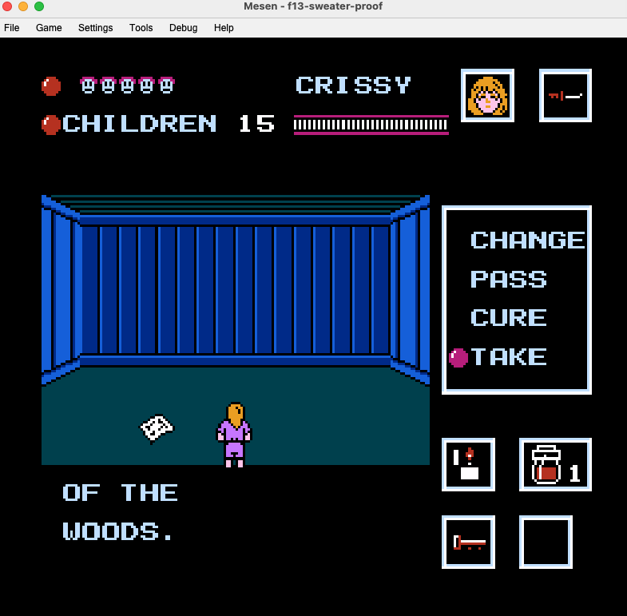

[The Configurizer](https://mlcjr.github.io/friday13-nes/configurizer/) &middot; **Reference** &middot; [RAM map](https://github.com/MLCJR/friday13-nes/blob/main/RAM-MAP.md) &middot; [CHR map](https://github.com/MLCJR/friday13-nes/blob/main/CHR-MAP.md) &middot; [ROM Hacks](https://github.com/MLCJR/friday13-nes/blob/main/ROMHACKS.md) &middot; [Patches](https://github.com/MLCJR/friday13-nes/tree/main/patches/)

---

# Friday the 13th (NES) — Technical Reference

Atlus / LJN, 1989. A complete description of how the game works, derived from
the ROM.

**Scope.** This describes the **1989 NES game**. There is an unrelated 2017
title of the same name; nothing here applies to it.

> ### How to read this
>
> Written for someone taking the game apart, but you do not need to read 6502 to
> use it. Facts are stated first and the code that proves them follows, so you
> can stop at any sentence and still have the answer.
>
> - **`$XXXX`** is an address in the machine, not a file offset. `$8000`-`$FFFF`
>   is the program, `$0000`-`$07FF` is the working memory the game thinks with.
> - **A record** is a fixed-size row in a table. Most of this game's behaviour is
>   table-driven, so "record 9 of the note list" is a specific handful of bytes.
> - **maskA / maskB** are the requirement bits on those rows: what you must have
>   done before the thing they gate will happen.
> - **A pose** is one animation, referenced by number. Creatures and counselors
>   are drawn by pose, not by name.
>
> Where the ROM and a published guide disagree, the ROM wins here and the
> disagreement is written down. Some sections retract earlier conclusions of our
> own; those are kept deliberately, because how a wrong answer looked right is
> worth as much as the right one.

**Dump.** Everything below was read from *Friday the 13th (USA)*, sha1
`8e79948042cbe4c1f03f432c5d99e25f6a07feb5`. Addresses are CPU addresses unless
marked CHR.

**Coverage.** All **32768 bytes** of PRG are accounted for, in 125 regions whose
boundaries are each re-derived from the ROM by an automated check. 32765 bytes
have a proven function; the remaining **3** (`$C734`-`$C736`) are proven
*unreachable* — not merely unexamined. Section 16 is the complete map.

**How to read a claim here.** Everything stated as fact was read out of the ROM
and can be checked against it. Where a community source is named, it is there
for corroboration or credit, not as the source of the claim — and where the ROM
and a guide disagree, the disagreement is written down rather than smoothed
over. Claims we could not settle are marked **open** in the text instead of
being rounded up to certainty; that language is deliberate and means exactly
what it says. Interpretation, where offered, is fenced off and labelled (see
section 12.7).

To check anything yourself: PRG file offset = address − `$8000` + 16 for the
iNES header. So `$E2D4` is byte `0x62E4` of the `.nes` file.

---

## Contents

1. [The cartridge](#1-the-cartridge)
2. [The map](#2-the-map)
3. [Jason](#3-jason)
4. [The counselors](#4-the-counselors)
5. [Combat and damage](#5-combat-and-damage)
6. [Items and progression](#6-items-and-progression)
7. [Enemies](#7-enemies)
8. [Pamela](#8-pamela)
9. [The alarm and the children](#9-the-alarm-and-the-children)
10. [Randomness](#10-randomness)
11. [Sound](#11-sound)
12. [Unreachable content](#12-unreachable-content)
13. [Defects](#13-defects)
14. [Reference tables](#14-reference-tables)
15. [Prior work and credit](#15-prior-work-and-credit)
16. [Appendix: the complete PRG memory map](#16-appendix-the-complete-prg-memory-map)

---

## 1. The cartridge

| | |
|---|---|
| Mapper | 3 (CNROM), submapper 2 — AND-type bus conflicts |
| PRG-ROM | 2 x 16 KB = **32 KB, fixed at `$8000-$FFFF`**, no banking |
| CHR-ROM | 4 x 8 KB = 32 KB, bankswitched |
| Mirroring | Vertical |
| Battery | None — the game cannot save |

Vectors: RESET `$8000`, NMI `$80B7`, IRQ `$815B`.

### CHR-ROM is also a data store

The game keeps bulk data — text, tables, palettes, room layouts — in CHR-ROM and
reads it back through the PPU data port at `$2007`. Two loaders do this:

| routine | what it does |
|---|---|
| `$E69D` | reads a 7-byte descriptor from the 18-record table at `$E77C`, then calls `$8253` for an arbitrary source/destination/length/bank transfer |
| `$E6E3` | reads a 3-byte `(src_lo, src_hi, bank)` record from the 28-record table at `$E728` and always transfers **exactly 168 bytes** to the fixed staging buffer at `$0758` |

Consequence: many addresses in this game appear in **no instruction operand at
all**, because they exist only as bytes inside CHR.

---

## 2. The map

### 2.1 Areas

The outdoor world is fifteen **areas**, numbered 0-14 in `$0500`.

| areas | region |
|---|---|
| 0 | the **lake loop** — the only area with a lake entrance |
| 5 | the **outer loop** |
| 6 | the cave approach |
| 1, 2, 3 | the three cave mouths |
| 4 | the lake |
| 7, 8, 9, 10 | the south woods |
| 11, 12, 13, 14 | the north woods |

**The three loops:**

| loop | areas | connects to |
|---|---|---|
| lake loop | 0 | the lake (4), the outer loop, and both woods (9 and 13) |
| outer loop | 5 | the lake loop, the cave approach (6), and both woods (7 and 11) |
| cave loop | 1, 2, 3 | each other, and out through 6 |

Area 0 is the only area with an entrance to the lake.

**The lake is its own small loop.** Its slot list is `03 00 8B 00 04 00 00 00` —
two junctions and one door. Both junctions lead back to area 0 and the door is
building 11, so rowing away from one opening takes you either to the other
opening or to the lake cabin, depending on direction and which side you started
from. The junction graph shows it as a dead end because that describes how it
connects to the rest of the map, not how you move inside it.

**The north woods holds two forest cabins, the south one.** The door lists at
`$BA5A` — a slot with bit 7 set is a door, its low 7 bits the building — put
cabin **21 in area 10**, cabin
**22 in area 12** and cabin **23 in area 14**. So areas 11-14 hold two and 7-10
hold one, which makes **11-14 the north woods**.

**The two woods are the same terrain.** Areas 11-14 share their terrain data
with 7-10 — the pointer tables at `$A163` (top row), `$A1DF` (bottom row) and `$A245` (a third array of the same shape)
give identical values for each pair — and they share their item lists through
`$F411`. Only the junction wiring differs.

### 2.2 Doors

`$BA5A` is a 15-entry pointer table, one per area, to per-area object lists. In
each list a byte with **bit 7 set is a door**, and its low 7 bits are the
building index. A non-zero byte with bit 7 clear is a **junction**.

Doors and junctions are entered by pressing **up or down**; `$B948` reads the
pad, picks a delta of `+8` for down or `-8` for up, and hands it to `$BF9F`,
which probes 8 pixels away and requires solid background there (`and #$C0`).
Which button works is therefore a property of the map, not of the door.

### 2.3 Buildings

Twenty-six building indices: **twenty-three structures plus three cave mouths.**

| index | kind | count |
|---|---|---|
| 1-10 | small cabins | 10 |
| 11-13 | lake cabins | 3, behind one door |
| 14-20 | big cabins | 7 — one fireplace each |
| 21-23 | forest cabins | 3 |
| 24-26 | cave mouths | 3 |

Index 0 means "no building".

**The lake door is a placeholder.** Door #11 resolves at `$B6A7` and `$BA0B` to
the first lake cabin that still has children in it, so cabins 11, 12 and 13 are
visited in order as each empties.

### 2.4 Interiors

`$E85C` folds the building index into five buckets. Those five buckets share
**four** interiors — buckets 0 and 1 land on the same rooms:

| bucket | buildings | entry room | layout | rooms |
|---|---|---|---|---|
| 0 | small cabins | `$14` | B | 8 |
| 1 | lake cabins | `$14` | B | 8 |
| 2 | big cabins | `$01` | A | 16 |
| 3 | forest cabins | `$19` — **needs the key** | C | 10 |
| 4 | cave | `$23` — **needs the key** | D | 5 |

The entry-room column is data, not inference: `$E85C` loads CHR descriptor 12 —
30 bytes from bank 1 `$0758` — and reads it as five 4-byte records
`(day palette set, after-dark palette set, entry room, unused)`. Its entry-room
bytes are `$14 $14 $01 $19 $23`. The cave is the only bucket whose lighting does
not change after dark.

The four layouts also account for the whole interior map exactly: 16 + 8 + 10 + 5
= **39 rooms**, which is the size of the room exit graph (CHR bank 1 `$076C`,
`[up, down, left, right]` per room, row 0 padding). Layout A is rooms
`$01`-`$10`, B is `$11`-`$18`, C is `$19`-`$22`, D is `$23`-`$27`.

### 2.5 Junctions

A junction byte `V` indexes a table of 5-byte records at record `V-1`. Byte 0 of
that record is the destination: high nibble to `$0500`, low nibble + 1 to `$75`.

The records are not in PRG. `$956B` loads **descriptor 6** of the `$E77C` table —
256 bytes from CHR bank 2 `$1C32` — into `$0200`, and decodes from there. (Watch
the two CHR tables: this is descriptor 6 of the 18-record `$E77C` table, not
block 6 of the 28-record `$E728` table, which is a hint string. `$9578`, the
boot-path sibling, uses descriptor 7 instead. Each sets the descriptor number
and falls into the loader call one instruction later, at `$9571` and `$957D` —
the addresses the CHR map cites for these same two loads.)

The resulting area graph:

```
 0 -> 4, 5, 9, 13        7 -> 5, 8, 9         11 -> 5, 12, 14
 1 -> 2, 3               8 -> 7, 9            12 -> 11, 13
 2 -> 1, 3               9 -> 0, 8, 10        13 -> 0, 12, 14
 3 -> 1, 2, 6           10 -> 8, 9            14 -> 11, 13
 4 -> 0, 0               6 -> 3, 5             5 -> 0, 6, 7, 11
```

Area 14 is reachable only from 11 and 13, and holds forest cabin #23 — the
deepest point in the game.

> **The lists are not a uniform length**, and assuming they are is the trap here.
> Sorting the 15 pointers and running each list to the next one up gives 16 slots
> (area 5), 12 (area 0), 8 (areas 4 and 6) and 4 for the other eleven. Those 88
> bytes plus the 30 bytes of pointers are exactly the 118 the manifest gives
> `$BA5A`-`$BACF` — zero slack. Reading every non-zero, bit-7-clear byte `V` as
> junction record `V-1` under that split reproduces all fifteen rows of the graph
> above: each of the eight woods areas (7-14) holds three non-zero slots of four,
> and each of the three cave-mouth areas (1-3) four of four. **Area 5 is where a
> uniform read fails** — it is a 16-slot list, and reading it as four or eight
> loses two of its five junctions.
>
> **Doors and junctions share one list**, so a non-zero slot is not the same
> thing as an exit: area 5's sixteen slots hold five junctions and seven doors,
> area 6's eight hold two junctions and four doors. Size a randomizer from the
> decoded byte, not from the slot count.

---

## 3. Jason

### 3.1 His route

Jason walks a **closed ring of 69 nodes** at `$B5AD`, 147 bytes. Each node is
two bytes:

| byte | bits | meaning |
|---|---|---|
| 0 | 7-4 | **area** — the area id, 0-14, not the area *type* |
| 0 | 3-0 | position within that area |
| 1 | 4-0 | building attacked here, 0 = none |
| 1 | 7-5 | dwell, in seconds |

Both halves check against the ROM: the 69 dwell fields sum to **230**, the lap
time stated below, and exactly **17** nodes carry a non-zero building, which is
the door-node count section 3.2 arrives at independently.

`$FF` is a jump escape: the next two bytes are a new pointer. Three of these
close the ring. `$050F` counts the dwell down once per second; at zero `$B87A`
advances to the next node. **A full lap is 230 seconds.**

His start is drawn once per game from the four-slot table at `$B5A5`
(`$B5AD, $B5F0, $B62D, $B5AD`), so the weighting is **50 / 25 / 25**. The
duplicate entry *is* the weighting. `$B58B` has one caller, in the cold-boot
block, so the ring position **carries across days** — on day 2 he continues from
where he was beaten.

### 3.2 Where he goes

The ring's door nodes, and only these:

| kind | he attacks | never |
|---|---|---|
| small cabins | 1, 2, 6, 7, 8, 9, 10 | 3, 4, 5 |
| big cabins | 15-20 | 14 |
| lake | 11, twice per lap | — |
| forest cabins | 21, 22 | 23 |
| cave mouths | — | 24, 25, 26 |

**He enters the cave but cannot be fought there.** `$B649` refuses to raise an
encounter for area types 1-4.

### 3.3 Speed

Three mechanisms scale with the day (`$0522`):

| what | how |
|---|---|
| pursuit speed | `speed_base + $0522`, the `adc $0522` at `$CE18` |
| which profile | per-day weighted sets at `$CE39` |
| script delays | a script byte minus `$0522 * 8`, floored at 1 |

`$0522` is 0, 1, 2 for days 1, 2, 3 — so day 1 is the unmodified value in every
one of the three.

There are three pursuit blocks. Block C has the tightest leash (`$20`) and the
highest speed base (`$07`); each day rolls one of four slots, and C's share of
those four slots is **25% on day 1, 50% on day 2, 75% on day 3**:

| day | the four slots | fastest block's share |
|---|---|---|
| 1 | A B A C | 25% |
| 2 | A C B C | 50% |
| 3 | C C B C | 75% |

Combined with the day bonus, this is why day 3 is relentless.

### 3.4 The cabin ambush

On entering the building his route currently names, `$0592` is set. A room is
then drawn from `$BBEC[bucket * 8 + ($31 and 7)]` and stored in `$05AB`; walking
into that room spawns him.

The cave bucket's eight candidates are **all zero**, and the reader begins
`lda $05AB : beq rts` — a third independent reason he cannot be fought there.

### 3.5 His cabin movement

Cabin movement is bytecode, run by the interpreter at `$D383`:

| byte | meaning |
|---|---|
| `$FD` | wait `max(1, n - $0522*8)` frames, where *n* is the byte that follows |
| `$FE` | set speed to `5 + $0522` and enter state 2, which swings the moment `abs((jason_x - 8) - player_x)` drops under **3 pixels** |
| `$FF` | pick a new script |
| other | a 4-byte move record |

The 4-byte record is `(duration, facing, x-speed index, y-speed index)` — byte 0
goes to `$D355`, which is `sta $0430,x : sta $0438,x`, the duration pair. It is
**not** a pose entry: nothing in this interpreter sets a pose.

`$D558` selects the script from `$D57B[day*8 + ($31 and 3)*2]`:

| day | scripts | distinct |
|---|---|---|
| 1 | `$D5AE $D5BD $D5AE $D593` | 3 |
| 2 | `$D5BD $D5AE $D5E2 $D5BD` | 3 |
| **3** | **`$D5E2` x4** | **1** |

On day 3 all four rolls give the same script, and three of its four waits hit
the one-frame floor. The result is the fixed, repetitive pattern players
recognise on day 3.

### 3.6 His weapon in a cabin

Jason appears bare-handed, then with a machete, then with an axe. The selector is
a plain counter of cabin encounters at `$05A9`:

```asm
inc $05A9                      ; every cabin spawn
ldy $05A9 : dey
cpy #$02 : bcc + : ldy #$02    ; capped at 2
+ tya : clc : adc #$37         ; pose = $37 + min(n-1, 2)
```

| encounter | weapon |
|---|---|
| 1st | fists |
| 2nd | machete |
| 3rd and after | axe |

The weapon is **cosmetic** — damage and speed are identical whichever he holds.

**It resets on every scene build.** `$05A9` counts cabin encounters **since the
last scene rebuild**, not across the run — and a rebuild happens on a day advance
*and on every counselor death*. `$8F34` is reached from `scene_build` (`$8D3D`),
which is entered from the cold-boot hub, from `$8E5C` on day advance, and from
`$8DF8` when a counselor dies and the run continues. So Jason drops back to fists
mid-day whenever you lose someone. On each day advance the scene setup at `$8F34` clears
`$0568-$05C7` — pointer `$0568`, length `$60`, fill `$00`, through the memset at
`$83D6` — and `$05A9` sits inside that block. Jason therefore opens every day at
fists and works back up:

| encounters *this day* | weapon | pose |
|---|---|---|
| 0–1 | fists | `$37` |
| 2 | machete | `$38` |
| 3+ | axe | `$39` |

On the day 2 → 3 rollover the memset covers `$05A9`, the value drops 2 → 0, and
Jason is back to fists.

**Nothing in the ROM clears `$05A9` by name.** It has two direct references and
neither is a write; the `inc $05A9` above is one of them. It is cleared as
collateral by a block fill that has never heard of it — the memset at `$83D6`,
reaching it through `sta ($00),y`. An indirect write like that is invisible to
any search over instruction operands, so "no instruction names this address" is
a statement about the search, not about the address.

### 3.7 Fleeing

```asm
lda $05B1 : cmp #$07 : bcc stay    ; fewer than 7 hits
lda $051C : cmp #$08 : bcc stay    ; 7 bars or fewer -> to the death
lda $0504 : cmp #$02 : bcc stay    ; 2 or fewer counselors -> to the death
```

The rule is static — no day term. Jason's health resets to 32 every day, so "he
is low" is a within-fight condition that applies equally on day 1. Counselors
remaining only ever decreases, so that condition becomes likelier over a run.

---

## 4. The counselors

Six, indexed 0-5 by `$0507`. Names at `$8AEB`.

| | George | Mark | Paul | Laura | Debbie | Crissy |
|---|---|---|---|---|---|---|
| kills before items (`$CC7E`) | **2** | 3 | 4 | **5** | 4 | 3 |
| run speed (`$B268`) | 4 | **5** | 4 | **5** | 4 | **5** |
| row speed (`$B045`) | 4 | **5** | 4 | 4 | 4 | 4 |
| cabin speed (`$BE94`) | 3 | **4** | 3 | **4** | 3 | **4** |
| jump arc | low | **high** | low | low | low | **high** |

Higher is faster. **Mark is the only fast rower in the game** — `$B045` gives
every other counselor 4.

### 4.1 Jump

`$B4F9` selects the arc: `cmp #$01` and `cmp #$05` — **only Mark and Crissy** are
tested. Everyone else falls through to the default.

| | first frame | table |
|---|---|---|
| Mark, Crissy | 24 | `$B574` |
| everyone else | 16 | `$B55D` |

The two tables differ in **three** bytes — the first frame (16 vs 24) and two more
entries (`$08` vs `$0C`) — so Mark and Crissy genuinely get a different arc, not
just a different opening frame. **Laura jumps exactly as George, Paul and Debbie
do**, sharing `$B55D` byte for byte — the widely repeated claim that she cannot jump is not in the code.

### 4.2 Throwing

`$C243`, indexed `counselor * 8 + weapon`. Six values per row, then two padding
bytes. Higher is a faster, longer throw.

| | torch | knife | axe | rock | machete | pitchfork |
|---|---|---|---|---|---|---|
| George | 9 | 10 | 8 | 12 | **8** | **10** |
| Mark | 7 | 8 | 6 | 10 | 8 | 10 |
| Paul | 9 | 10 | 8 | 12 | 10 | 12 |
| Laura | 7 | 8 | 6 | 10 | 8 | 10 |
| Debbie | 9 | 10 | 8 | 12 | 10 | 12 |
| Crissy | 9 | 10 | 8 | 12 | 10 | 12 |

**Mark and Laura are byte-identical.** So are Paul, Debbie and Crissy. George is
the only counselor with a row of his own, and it differs from the Paul row only
in the machete and pitchfork columns.

> Read at stride 6 this table appears to give six distinct rows, each shifted two
> bytes from the last. That is the padding. The stride is 8.

---

## 5. Combat and damage

### 5.1 What the player's weapons do

`$DF2D`, indexed by weapon:

| weapon | id | damage | hits per bar of Jason (`$D4D6`) |
|---|---|---|---|
| torch | 0 | 3 | **1** |
| knife | 1 | 2 | 4 |
| axe | 2 | 3 | 2 |
| rock | 3 | 1 | 5 |
| machete | 4 | 3 | 3 |
| pitchfork | 5 | 4 | **1** |

`$D4D6` is indexed by **weapon only** — every counselor holding the same weapon
needs the same number of hits.

### 5.2 What enemies have and do

`$DF4B` is hit points; `$DF68` is damage dealt to a counselor.

| type | enemy | HP | damage | with sweater |
|---|---|---|---|---|
| 0 | zombie | 3 | 2 | 1 |
| 1 | Jason (contact, field) | — | 7 | 3 |
| 2 | Jason (cabin) | — | 8 | 4 |
| 3 | wolf | 10 | 3 | 1 |
| 4, 5, 6 | bat, crow, stalactite | 1, 1, 0 | 1 | **0** |
| 7 | lake zombie | 2 | 2 | 1 |
| 10 | Pamela | 30 | 5 | 2 |
| 12 | Jason (lake) | — | 5 | 2 |
| — | Jason's thrown axe | — | 5 | 2 |

Jason's forms carry `$FF` in `$DF4B`; his health is a separate 32-tick counter at
`$051C`.

**On types 4, 5 and 6.** Type 4 is the **bat**, type 5 the **crow**, type 6 the **stalactite** — fixed by
the per-type dispatch table at `$CB55` (4 → `$CFAB`, 5 → `$CFCE`, 6 → `$D033`) and
confirmed by the spawn-init table at `$D0B0`. All three deal 1 damage; the
stalactite has 0 HP (`$DF4B[6]`) and cannot be destroyed.

**On the thrown axe.** It is not an enemy type and has no row in `$DF4B`, so it
carries no HP of its own — `$C32A` disposes of the projectile on impact. Its
damage comes from a different table, `$DF2D`+6 = **5**, reached through `$DD2C`
→ `$DF1D`. The sweater still halves it to 2: `$DD86` is `jmp $DCF6`, which
lands in the ordinary-contact path *just past* the `$DF58` lookup, so the axe
skips `$DF68` but still passes through the same `lda $051B : beq : lsr $00` at
`$DCF8`. Section 5.3 has the three damage paths side by side.

Every hit count quoted by the community falls out of these two tables. Zombie
3 HP ÷ rock 1 = 3 stones. Wolf 10 ÷ knife 2 = 5 knives. Pamela 30 ÷ machete 3 =
10. The sweater halves damage, rounded down, which is why it makes bats, crows
and stalactites completely harmless.

### 5.3 Three separate paths damage a counselor

This matters to anyone patching the game:

| path | routine | table |
|---|---|---|
| ordinary contact | `$DCEE` → `$DF58` | `$DF68` |
| Jason's thrown axe | `$DD2C` → `$DF1D` | **`$DF2D`+6** |
| the alarm timer | `$B7CF` | **`$B7EC`** |

The second reaches the counselor through entity slot 6 and `jmp`s past the
`$DF58` lookup entirely, so it never consults `$DF68` — but `$DD86` is
`jmp $DCF6`, which lands *after* that lookup and *before* the sweater test at
`$DCF8`, so the axe is still halved. The third is the passive damage a trapped
counselor takes and **the sweater does not reduce it**.

#### The alarm's damage curve

`$058A`, `$058B` and `$058C` are not three variables — they are one **3-digit BCD
counter**, hundreds, tens and units. `$B768` points the BCD subtractor at `$058A`
with a digit count of 3 (`lda #$8A : sta $00 / lda #$05 : sta $01 / … / lda #$03
: sta $04`), and `$840A` decrements all three together by the value at `$B875`.
The alarm starts at **060**: `$B6EC`/`$B6EF` zero the hundreds and units,
`$B6F2` puts `#$06` in the tens.

Damage lands on ticks where the **units digit is 0** (`$B78F`: `lda $058C :
beq` into the penalty), once per ten counts, plus one extra tick at 8 seconds
exactly: the `cmp #$08` path falls into a second test at `$B79B` that takes the
penalty only when the tens digit is also zero. The amount is the **tens digit**
indexed into `$B7EC` at `$B7CF`:

| tens digit | 6 | 5 | 4 | 3 | 2 | 1 | 0 |
|---|---|---|---|---|---|---|---|
| damage per tick | 0 | 0 | 2 | 2 | 4 | 8 | 8 |

So a trapped counselor takes nothing for the first third of the alarm, the
first damaging tick landing at 40, then takes 2, 2, 4, and 8 twice: the curve
escalates as the timer runs down. It is subtracted
from that counselor's own health at `$0738,y` (`$B7D6`), not from the active
counselor's, and `$B7D9`'s `cmp #$05 : bcc` skips the subtraction entirely once
health is below 5, so the alarm alone cannot finish someone off.

---

## 6. Items and progression

Items are `$0517`-`$051B`, written by one generic counter (`inc $0517,x`,
`x = type - 7`).

Twelve item types exist, each with its own sprite in CHR bank 2:

| type | becomes | | type | becomes |
|---|---|---|---|---|
| 1 | knife | | 7 | **lighter** |
| 2 | machete | | 8 | **flashlight** |
| 3 | axe | | 9 | vitamins |
| 4 | torch | | 10 | key |
| 5 | pitchfork | | 11 | (also counts to the sweater) |
| 6 | **sweater** | | 12 | machete, the 60-kill drop |

The counters they feed:

| type | address | item | effect |
|---|---|---|---|
| 7 | `$0517` | **lighter** | gates the fireplaces; the kill-reward drop offers it first and keeps re-offering it until taken. World spawns gate on `$051F` bit `$01`, not on the lighter |
| 8 | `$0518` | **flashlight** | lights the caves |
| 9 | `$0519` | **vitamins** | max 9; revives at 6 health |
| 10 | `$051A` | key | opens forest cabins and the cave's locked rooms |
| 11 | `$051B` | sweater | halves damage |

### 6.1 The lighter → flashlight chain

```asm
lda $0517 : beq done        ; no lighter, no fire
...
inc $0521
lda $0521 : cmp #$04 : bcc + ;  4 lit -> set $051F bit $20 (unlocks a hint)
           cmp #$07 : bcc + ;  7 lit -> spawn item 8
                lda #$08 : jsr $F477
```

Seven big cabins, one fireplace each. The flashlight is **dropped on the ground
at fixed coordinates**, not added to inventory — leave the screen and it is gone.

**The count is per counselor.** When one dies, `$8EA6` loads the next one's
slots and four bytes change in the same frame:

```
f=35026  $051F progressA:  EF -> 00
f=35026  $0520 progressB:  06 -> 00
f=35026  $0517 lighter:    01 -> 00
f=35026  $0521 fireplaces: 06 -> 00
```

The new counselor inherits nothing — not the fireplace count, not the lighter,
not the notes, not a single progress bit. It is a **swap, not a wipe**: the dead
counselor's six is preserved in their `$0714+n` slot and returns if you switch
back. The practical consequence is that **seven fireplaces must be lit by one
counselor**, because no two can pool their counts, and the same is true of every
`$051F` and `$0520` condition behind the silent drops.

The *claim* flags at `$0695`-`$069B` are separate and also per counselor, so a
fireplace another counselor already lit is still unclaimed for you: lighting it
passes the flag test and bumps **your** counter. Nothing resets `$0521` on a day
advance either — none of the four `jsr $83D6` block clears covers it. So a
counselor's count runs from 0 to 7 across the whole game and stops there.

**A note for anyone changing this.** The threshold at `$E9B7` is
`cmp #$07 : bcc skip` — `>=`, not `==`. That never shows in the shipped game,
because seven fireplaces and one claim each means the count cannot exceed 7. Add
an eighth fireplace and the eighth lighting spawns a second flashlight, and so
does every one after it.

The in-game hint reads *"USE THE TORCH TO LIGHT THE FIREPLACES."* **The code
checks the lighter.** The torch is weapon 0 and is never consulted.

### 6.2 What spawns in the world

The world spawns only three item types. Totals across the whole game:
**12 knives, 14 vitamins, 6 keys**. The north and south woods share one pool, so an
item taken in one does not appear in the other.

Everything else comes from a fixed source: the machete and axe from forest
cabins or the cave, the sweater and pitchfork from Pamela.

### 6.3 The hidden drops — the torch, the axe, and how they are earned

Some items are not in any spawn list. They appear inside a specific building the
moment a set of conditions is met, with nothing on screen to announce it. The
torch and the axe are the two that matter, and both are reachable in normal play.

**One gate serves both notes and items.** `$ED72`:

```asm
lda $051F : and $0758,y : cmp $0758,y : bne fail   ; maskA, ALL bits required
lda $0520 : and $0759,y : cmp $0759,y : bne fail   ; maskB, ALL bits required
lda $075A,y                                        ; the payload
```

Y selects the record. The same gate serves notes and items, and the payload means
a different thing on each path: a **note block number** on one, an **item type**
on the other.

**The two drops:**

| | torch | axe |
|---|---|---|
| where | **building 19** — area 0, the big cabin nearest the north woods | **building 22** — area 12, in the north woods |
| record | Y=24, `(05, 06, 04)` | Y=18, `(CD, 06, 03)` |
| `$051F` needs | `$01 + $04` | `$01 + $04 + $08 + $40 + $80` |
| `$0520` needs | `$02 + $04` | `$02 + $04` |

Both need the same two `$0520` bits — **two notes, from different number bands.**
`$EAD2` sets `$02` for a note numbered under 5 and `$04` for one numbered 5 to
12. Nothing else the player does moves those bits.

**The five `$051F` bits the torch and axe records demand, and the action behind
each** (the other three, `$02`, `$10` and `$20`, are covered in the text of
sections 6.1, 6.3 and 6.4):

| bit | set at | what you did |
|---|---|---|
| `$01` | `$CC68` | killed a land zombie — this is the item gate for everything |
| `$04` | `$BD8F` | `$050C` reached 2 — entered a building, left, entered again |
| `$08` | `$B9D4` | **entered a woods area three times** — `$051D` counts entries to areas 7-14 |
| `$40` | `$F516` | picked up a **knife** (`$0506` becomes 1) |
| `$80` | `$F546` | picked up **the key** — `$F541` is `inc $0517,x` with `x = type - 6`, and slot 3 is `$051A` |

So in plain terms:

**The notes have masks of their own, and that is where the knife and key come
in.** The same gate serves them, so a note only appears once its own record
passes:

| note | record needs | which means |
|---|---|---|
| `$03` "GO INTO THE WOODS" | `$051F` `$01 + $40` | your kill quota met, and **a knife in hand** |
| `$0C` "FIRE WILL DAMAGE JASON THE MOST" | `$051F` `$01 + $04 + $80` | your kill quota met, two cabin transitions, and **the key** |

So on this route, through notes `$03` and `$0C`, the knife and the key are
**genuine requirements for the torch**, one step removed: without the knife
note `$03` never appears, without the key note `$0C` never does, and the torch
needs the `$0520` bits those notes set. The knife requirement belongs to the
route rather than the torch: section 6.4 shows a knife-free variant through
note `$02`.

**The torch, in order, on this route.** Kill zombies until items drop. Pick up
a knife — note `$03` will not appear without it. Read that note in the big
cabin nearest the north woods entrance — building 19, in area 0. Get the key,
and go to the woods cabin: building 22, in area 12, reached from area 0 through
13. Enter it, leave, enter again: the second entry is what raises note `$0C`,
and the double entry also satisfies `$04`. Read it. Return to building 19 and
the torch is there.

**The axe** is the same trip with one more lap of the woods. It needs everything
the torch needs, plus a knife in hand, plus `$051D` at 3 — and `$051D` counts
**entries to a woods area**:

```asm
$B9B5  lda $0500            ; the area
       beq  $B9E3           ; area 0        -> counts nothing
       cmp #$07 : bcs $B9D4 ; areas 7-14    -> inc $051D, bit $08 at three
       cmp #$04 : bcs $B9E3 ; areas 4,5,6   -> counts nothing
       inc $051E            ; areas 1-3     -> bit $10 at three
```

`$051D` counts woods **areas entered**, not trips: the walk from area 0 to
building 22 crosses two (area 13, then area 12), so the torch route reaches the
cabin with the count at 2, and the walk back out through 13 only makes 3 once
the axe's building is behind you. The axe wants **three** while you are still
inside building 22, one extra woods transition and a return, which is exactly
the "one extra woods transition" runners describe. It then appears in the
**woods cabin**, not building 19, so it is the harder of the two rather than a
shortcut to it.

**`$F541` writes the whole inventory array.** `inc $0517,x` indexes it by
`type - 6`, so it is the writer for `$0517`-`$051B` — the lighter, flashlight,
cure, key and sweater counts. The two compares that follow test the *index*, not
the count: slot 3 is `$051A`, the key, and sets `$051F` bit `$80`; slot 1 is
`$0518`, the flashlight, and sets `$0520` bit `$01`. No search over instruction
operands finds any of this, because the address written is computed — which is
why four of those five RAM rows recorded no writer at all.

> **`$0758` is not a fixed table.** It is the shared 168-byte CHR staging
> buffer, re-streamed per room, so what sits in it depends on which block was
> transferred last — read CHR block `$18` as a table indexed by building and the
> answer changes with when you read it. The gate reads `$0758,y`, and **Y is the
> only thing that names a record.**

### 6.4 The flashlight, and the rest of the torch gate

Item **8**, and its only source is the fireplaces:

```asm
$E9A6  inc $0521           ; fireplaces lit
       lda $0521 : cmp #$04 : bcc skip
       lda #$20 : jsr $EC3B ; at FOUR, $051F bit $20
       cmp #$07 : bcc skip
       lda #$08             ; item 8, the flashlight
       lda #$78 : sta $01   ; at a FIXED screen position
       lda #$98 : sta $02
       jsr $F477
```

`$0521` is read at **exactly one place in the ROM**, the block above, so
fireplaces do two things and nothing else: grant progress bit `$20` at four lit,
and place the flashlight at seven.

**The flashlight appears at a hardcoded position in the room where you light the
seventh fireplace, and it is placed once.** There is no persistence — leave the
room without taking it and it is gone for that run. That is a direct consequence
of `$F477` being handed a literal `$78,$98` rather than a saved slot.

**Why a torch seems to follow the fireplaces.** `$E9B3` does set `$051F` bit
`$20` at four lit, and `$051F` is what the gate ANDs `maskA` against — but the
torch record wants `maskA = $05`, which does not include it. The fireplace count
does not gate the torch.

What connects the two is `$050C`: lighting a fireplace means entering a cabin,
and two cabin transitions set bit `$04`, which the torch record *does* want. A
player who lights four fireplaces has entered at least four buildings, so bit
`$04` arrives incidentally along the way. The torch really does turn up around
then; the count is not the cause.

**Every record the torch and axe chains touch**, and none of these five wants
bit `$20`:

| Y | building | maskA | payload |
|---|---|---|---|
| 6 | 18 | `$01` | note block 2 |
| 9 | 19 | `$41` | note block 3 |
| 18 | 22 | `$CD` | axe |
| 24 | 19 | `$05` | torch |
| 36 | 22 | `$85` | note block 12 |

The records are streamed per room into `$0758` rather than sitting in one
table; every entry above was read off the gate during play. One record in the
game does want bit `$20`: the hint that four lit fireplaces unlock (6.1), which
gates text, not an item.

**Two records this table does not list can never fire.** Building 21, the south
woods cabin, holds them both, and both demand `$0520` bit `$10`. That register
has only three inputs and can never exceed `$07` (12.1), so bit `$10` is
unsettable and neither record is reachable by any means.

**Building 23 holds a machete**, on `maskA = $CD` and `maskB = $06` — the axe's
exact requirement set plus the two notes. It is the only drop found outside
buildings 19 and 22.

**Consequence for the route: the key is mandatory.** Two notes are needed, one
from each number band, and the band from 5 to 12 has exactly two members — note
`$06` in building 17 and note `$0C` in building 22. Both demand `$051F` bit
`$80`, which only picking up the key sets. There is no cheaper second note, and
no way to reach the torch without one.

**The knife is not required for the torch.** The commonly documented route reads
note `$03` in building 19, whose record carries `maskA = $41` and does need the
knife — which is why every guide names it. Note `$02` in **building 18**, the
other big cabin on the same lake loop, carries `maskA = $01`:

```
f=8705   $051F 04 -> 05   Mark's 3rd kill meets his quota. bit $01 set, $40 NOT
f=9657   building 18, maskA=01, PASSES  ->  note $02 appears
f=10853  $0520 00 -> 02   read; first band satisfied
f=12006  $051F 05 -> 45   a knife is finally picked up, 2,349 frames later
```

The note appeared with `$051F = 05` — bits `$01` and `$04` only. The run then
took the key, read note `$0C` in building 22, and collected the torch in
building 19 at `f=18068`. **A complete torch, with the knife arriving long after
it stopped mattering.**

Chaining the masks, the torch's true requirements are:

| | bit | how |
|---|---|---|
| `$051F` `$01` | the item gate | kill land zombies up to **your counselor's quota** — see below |
| `$051F` `$04` | two cabin transitions | enter, leave, enter |
| `$051F` `$80` | **the key** — demanded by note `$0C`, the only affordable note in the 5-12 band | pick up a key |
| `$0520` `$02` | any note numbered under 5 | note `$02`, building 18 — needs nothing but the zombie |
| `$0520` `$04` | any note numbered 5 to 12 | note `$0C`, building 22 |

#### The route, and a shorter one

The route runners use, in mask terms:

1. Kill zombies to your counselor's quota — `$051F` bit `$01`.
2. Read **note `$03` in building 19**, the torch cabin. Its record wants
   `maskA = $41`, so this is where the knife requirement comes from.
3. Take a key. Cross to **building 22** and enter it twice: the second entry
   raises **note `$0C`**, whose record wants `maskA = $85` — the key and the two
   cabin transitions.
4. Return to building 19. `maskA = $05`, `maskB = $06`, and the torch is placed.

**The shorter version.** Step 2 is the only step that needs a knife, and it is
avoidable. **Note `$02` in building 18** — the other big cabin on the same lake
loop — carries `maskA = $01`, so it needs nothing but the quota. Read it instead
of note `$03` and the knife never enters the chain:

1. Kill to quota.
2. Read **note `$02` in building 18**. No knife.
3. Key, then **note `$0C` in building 22**, entering twice.
4. Building 19. Torch.

Whether it is *faster* depends on the walk between buildings 18 and 19 against
the time saved not stopping for a knife.

Two things the shorter route does **not** avoid: the key, which the only two
notes in the 5-to-12 band both demand, and the two cabin transitions, which the
torch record wants directly.

**The item gate is a per-counselor quota, not one kill.** `$CC52` reads
`$CC7E,y` indexed by `$0507`, so how many zombies open item spawning depends on
who you are playing:

| George | Mark | Paul | Laura | Debbie | Crissy |
|---|---|---|---|---|---|
| 2 | 3 | 4 | 5 | 4 | 3 |

At the quota, `$051F` bit `$01` is set. At **double** the quota the same routine
sets bit `$02` — `asl $00` doubles the threshold and compares again. That is the
only writer of bit `$02`, and it is invisible to a search for `lda #$02` because
the value arrives through `ldy #$02 : tya`.

Guides that quote a fixed number — "three, sometimes four" — are quoting this
table from the outside: it depends which counselor is holding the controller.

**The key is mandatory and the knife is not.** Guides list both because the
route they describe goes through building 19, whose note wants the knife; taking
the first note from building 18 instead removes that requirement entirely.

The kills that produce the key scatter knives anyway, so the saving is the
moment spent stopping for one rather than a shorter route. What is settled is
that it is not a
*requirement*.

**The torch and the flashlight can arrive in the same cabin**, from two
unrelated mechanisms — the silent-item gate, and the seventh fireplace. They
share a room only because that is where the seventh fireplace was lit: `$E9C7`
places the flashlight at a fixed `$78,$98` in the *current* room, so it follows
the player, not the building.

**The notes are interchangeable.** The gate wants **one note from each number
band**, not two specific notes, which is what `$EAD2`'s `cmp #$05` and
`cmp #$0D` decide. Any note under 5 and any note from 5 to 12 will do — blocks
`$00` and `$06`, from buildings 14 and 17, open the torch exactly as the `$03`
and `$0C` of the usual route do.

Picking up **item 8** sets `$0520` bit `$01` — slot 1 of the `inc $0517,x`
array.

---

## 7. Enemies

| enemy | where | notes |
|---|---|---|
| zombie | everywhere | 1 on screen by day, 2 at dusk, 3 at night |
| lake zombie | the lake | leaps at the boat |
| bat | the cave | dusk and night only |
| stalactite | the cave | night only; cannot be destroyed |
| crow | field and lake | dives once, then leaves |
| wolf | cave screen 3, woods at dusk/night | pounce (duck) or charge (jump) |

Zombie speed scales with the day (`$CBDB`, indexed by `$0522`: 3, 4, 4).

Only **zombies and wolves** ever flee from Jason (`$05B2`); every other enemy
ignores him.

---

## 8. Pamela

Room `$24` — one interior reached through the locked door on any of the three
cave screens. Her spawn tests **the room number and nothing else**; there is no
area check anywhere in it.

- 30 HP (`$DF4B[10]`) — 30 rocks, 15 knives, 10 machete/axe/torch
- deals 5 damage (2 with the sweater)
- once per day **globally**, not once per counselor (`$0689`, = `$0684+5`)

  `$0689` is set by `lda #$01 : sta $0689` at `$F38F` when the gift is granted,
  and cleared at `$8E3D` on day advance. The store is unconditional -- `sta`, not
  `ora` -- so whichever counselor actually fights her, the byte always records it
  as though George did, wiping anything another counselor had claimed there.
  Only one counselor gets her per day, and this single flag is the whole reason;
  there is no separate "only one counselor alive" check.

### 8.1 Her rewards

Day 1 gives a weapon determined by the one you beat her with (`$F393`):

| you hold | she gives |
|---|---|
| rock, knife | machete |
| machete, torch | axe |
| axe, pitchfork | torch |

Day 2 gives the **sweater**. Day 3 gives the **pitchfork**.

### 8.2 Her dives

`$D7E3`, eight entries per day, consumed cyclically:

| day | pattern |
|---|---|
| 1 | 2 3 2 2 3 2 2 2 |
| 2 | 1 1 0 2 1 1 1 2 |
| 3 | 0 2 0 0 2 0 1 2 |

A zero produces a straight drop rather than an arc.

---

## 9. The alarm and the children

Fifteen children in three lake cabins (`$0513`-`$0515`, five each). When Jason
reaches a counselor or the children, a 60-second timer starts.

**A trapped counselor bleeds** on a schedule set by `$B7EC`, indexed by the
timer's tens digit:

| timer | damage | running total |
|---|---|---|
| 40 | 2 | 2 |
| 30 | 2 | 4 |
| 20 | 4 | 8 |
| 10 | 8 | 16 |
| 8 | 8 | 24 |
| 0 | dies | |

The sweater does not reduce this. Children die at 30, 20, 10, 8 and 0 seconds —
five per visit. If your active counselor dies the timer resets to 60 without
healing the victim, so a single visit can kill more than five children.

---

## 10. Randomness

`$31` is the RNG. It is stirred every frame, so almost everything the game calls
"random" is really a function of **when** you act.

Genuinely rolled:

| what | where |
|---|---|
| the camp map layout | `$E0D2`, 256 possible seeds |
| Jason's starting position | `$B5A5`, four slots, **50 / 25 / 25** |
| which speed profile he uses | `$CE39`, weighted per day |
| the cabin ambush room | `$BBEC[bucket*8 + ($31 and 7)]` |
| his cabin movement script | `$D57B[day*8 + ($31 and 3)*2]` |

Not random at all: item locations, message locations and contents, weapon
spawns, Pamela's dive pattern, and which cabins Jason attacks.

Jason's route position **carries across days** — the roll happens once, at cold
boot. On day 2 he continues from where he was beaten.

---

## 11. Sound

A bytecode engine at `$F6F6`, with a 19-entry pointer table at `$FAE1`
(`$00`-`$12`) and a play-sound API at `$8F48`.

The API is a stub table of `lda #imm : bne` pairs, and it emits:

```
$01 $02 $03 $04 $05 $06 $07 $08 $09 $0A $0B $0C $0D $0E $0E $10 $11
```

`$0E` appears twice, and the second stub (`$8F80`) has **no caller at all**. So
seventeen stubs emit sixteen distinct ids, and three of the table's nineteen
entries have no stub: `$00`, `$0F` and `$12`.

`$00` is not cut content — it is the off switch. The dequeuer at `$F690` does
`asl a : beq`, so id 0 branches to the APU reset at `$F648` before the pointer
table is ever indexed: "play sound 0" means "silence everything", and slot 0 of
`$FAE1` is never followed. `$0F` and `$12` have no such interception. See
section 12.

**Seven of the sixteen command handlers are never used by any shipped sound** —
`CALL`, `RETURN`, `SWEEP_OFF`, `PORTAMENTO+1`, `NOP`, `CHAIN`, and one unnamed.
`CHAIN` matters: it is the only instruction by which one sound can invoke
another, and therefore the only route by which a sound with no API stub could
ever have been reached. Zero CHAIN commands exist anywhere in the ROM.

---

## 12. Unreachable content

**Eleven things in this cartridge cannot be reached in normal play**: two hint
messages, four rows of the silent-item table, two sound effects, and three groups
of item sprites that no descriptor selects. Two more were never in the cartridge
at all — they are known only from a 1989 press kit describing a version of the
camp that did not ship.

### 12.1 Two hint messages

Hints are blocks `$00`-`$0C`, selected by `$05A7`, which has exactly one writer
(`$E9F2`). That write only happens if a gate passes, requiring **every** bit of a
per-hint mask to be set in `$051F` and `$0520`.

Block `$0D` — "YOU CAN'T GET IN WITHOUT A KEY" — is **not** a gated hint. `$BCDA`
sets it with a literal `lda #$0D`, bypassing `$05A7` and its mask entirely,
which is why the gate table holds 13 records of 3 bytes and not 14.

`$0520` has three references in the entire ROM: `ora $0520` and `sta $0520` at
`$EC42`/`$EC45`, which are one two-instruction routine, and `lda $0520` at
`$ED7D` inside the gate. So there is exactly one writer, and it can only ever OR
in what its callers hand it. It has two callers, and both are `jsr`: the one at
`$F54E` is preceded by `lda #$01`, and the one at `$EAE2` by `tya` with Y already
`$02` or `$04`. Those three values are the entire input set, so **`$0520` can
never exceed `$07`**.

Those three references are the complete set. Nothing `jmp`s to the writer and
nothing enters it mid-routine; no other store, logic or shift opcode names
`$0520` in any addressing mode; and the address is never assembled from split
immediates, in either byte order.

**The indirect path is closed too.** A zero-page indirect memset writes bytes no
operand names — it is how `$05A9` is cleared without any instruction mentioning
it (section 3.6). The RAM-init table in CHR block 20 does reach this range:
record 0 is `length 40, destination
$0500, fill $00`, which covers `$0500-$0527` and therefore `$0520`. It runs once
at cold boot and its fill is **zero**, so it can only clear the byte, never push
it above `$07`. Every record in that table overlapping `$0500-$0527` fills with
zero. The ceiling holds against this path as well as the direct ones.

**`$051F` has no such ceiling.** It is built by the same idiom — one `ora`/`sta`
pair, at `$EC3B`/`$EC3E`, read at `$ED72` and `$F471`, four references in total —
but that writer has **eight** callers, and between them they supply `$01`, `$02`,
`$04`, `$08`, `$10`, `$20`, `$40` and `$80`. Every bit of `$051F` is settable;
only three of `$0520`'s are. Same mechanism, different wiring.

Two messages demand more than `$07`:

| hint | needs | text |
|---|---|---|
| `$0A` | bit `$08` | "YOU CAN FIND A SWEATER HIDDEN IN THE MIDDLE OF THE WOODS." |
| `$0B` | bit `$10` | **"THE ONLY WAY TO GET TO THE SWAMP IS THROUGH THE CAVE."** |

The text is at CHR bank 0 `$1218` (file offset `0x9228`). The word `SWAMP`
appears **exactly once in the cartridge** and nowhere in PRG.

Both messages read correctly on the real screen. `patches/f13-swamp-proof.bps`
and `patches/f13-sweater-proof.bps` (included in this release) each repoint a
reachable hint at the orphaned block, so the game draws it through its own text
routine — the same way it would have, had the gate ever opened.




> "THE ONLY WAY TO GET TO THE SWAMP IS THROUGH THE CAVE."





> "YOU CAN FIND A SWEATER HIDDEN IN THE MIDDLE OF THE WOODS."

**There is no swamp.** No area entry, no junction record, no terrain, no room
layout. Every junction in the three cave areas resolves to a real area. The hint
was written, given a data slot in sequence with the others, and assigned a
specific unlock condition — and the place it describes was never built, or was
removed before the map data was finalised.

### 12.2 Two silent-item rows behind the same dead bits

These are the unreachable rows. The **reachable** silent drops — the torch and
the axe, and exactly what earns them — are sections 6.3 and 6.4.

The two unreachable hints are not the only things gated on bits `$08` and `$10`
of `$0520`. Two rows of the silent-item table need them too:

| row | building | room | needs | payload |
|---|---|---|---|---|
| 2 | 16 | 16 | bit `$08` | `$00` — **nothing** |
| 3 | 21 | 31 | bit `$10` | `$00` — **nothing** |

These two are dead **twice over**. Their masks demand `$0520` bits that can never
be set, and their payload byte is `$00`, so even a row that fired would place no
item.

> **Read the payload byte, not just the row.** A row's masks can be satisfiable
> and it can still place nothing, because the third byte decides what appears.
> The reachable drops are in 6.3 and 6.4.

### 12.3 Two silent-item rows wired to nothing

Rows 9 and 10 of the silent-item table are unreachable a second, independent
way: they require the same unsettable bits **and** map to no building or room at
all. The drop-list table in CHR block `$18` opens with fourteen two-byte pointer
slots; the reader can index only the first thirteen, one per building 14-26, and
the fourteenth is null. Nine of the thirteen are non-null, and between them they
name record indices 0 through 8 — never 9, never 10. They were never connected
to a spawn trigger.

Row 9 is `(D2, 0F, 06)` and
row 10 is `(D2, 17, 05)`. Payload `$06` is the **sweater** and `$05` is the
**pitchfork** — the two items Pamela hands out on days 2 and 3. Their mask-B
bytes contain `$08` and `$10` respectively, which is the same dead-bit pattern as
12.1 and 12.2. This is a fact about the table, not a conclusion about
development; see 12.7 for what can and cannot be built on it.

### 12.4 Two sounds

| id | data | size | why unreachable |
|---|---|---|---|
| `$0F` | `$FF36` | 10 B | table entry, no stub — a single-channel blip |
| `$12` | `$FFA8` | 77 B | table entry, no stub — **four channels** |

`$12` is a complete, well-formed cue: four channel records, all pointing at real
data, cleanly terminated. It is the largest never-executed run in the ROM, and it
is a 32-note chromatic descent, G down to C, spanning 2 octaves and 7 semitones.

Both have been **heard**. `patches/f13-hear-0F.bps` and `patches/f13-hear-12.bps` (included in this release)
each repoint a reachable sound id at the orphaned data, and both cues play
correctly — confirming the data is intact and that only the dispatch stub is
missing.

🔊 **[`audio/sound-12.wav`](audio/sound-12.wav)** — `$12` as it sounds, captured
from the `f13-hear-12` patch. 1.3 seconds; nothing in the shipped game plays it.

### 12.5 Unused item graphics — partly open

**What is settled:** the item descriptor table at `$F618` holds 12
records of 4 bytes, indexed by **item type − 1** (`$F605` is the `sbc #$01`, and
the two `asl`s after it make the stride 4). Byte 0 is the CHR tile base and
byte 2 is the sprite size as packed width/height nibbles. The record names no
bank: the art for five of the twelve types (the knife, lighter, vitamins, key
and the machete as it lies on the path) lives in banks 0 and 1, the other
seven in bank 2. The twelve tile
bases are `31 84 8A 80 E1 5B 05 E5 09 03 F3 01`. Only two of them fall inside the
item block — `$84` (1x3, the machete) and `$8A` (1x3, the axe) — and none of
`$87`, `$8D` or `$90` appears. Those tiles exist, they are drawn, and nothing in
the descriptor table selects them.

The item region runs `$84`-`$91`; at `$92` the bank switches to counselor
sprites drawn from behind, as seen in the cabin fight.

**What is NOT settled: what the unselected tiles depict.** The Cutting Room
Floor documents three unused graphics for this game — a whistle, a vial and a
small candle. Rendered as 1x3 verticals, `$8D`-`$8F` reads plausibly as a narrow
neck over a bulbous body; the other two do not resolve into whole objects under
any grouping tried.

Grouping is the trap here. Only **two** of the twelve item sprites are 1x3, so
that stride cannot be applied across the block — do it and the run past `$8F`
picks up two halves of a counselor sprite and reads as a phantom fourth item.
Sheet-relative grouping (stride 16) is worse. The correct grouping for the
unselected tiles is **not currently known**.

Tile by tile:

| tiles | status |
|---|---|
| `$84`-`$86` | **used** — item type 2, the machete (descriptor record 1) |
| `$87`-`$89` | present, drawn, **selected by no descriptor** |
| `$8A`-`$8C` | **used** — item type 3, the axe (descriptor record 2) |
| `$8D`-`$8F` | present, drawn, **selected by no descriptor** |
| `$90`-`$91` | present, drawn, **selected by no descriptor** |

(Record index and item type differ by one — see the stride note above. Section 6
numbers the types; this table gives both so the two cannot be confused.)

Whether these are TCRF's whistle, vial and candle — and which is which — is an
open question, not a finding. Anyone with the original reference images and an
eye for this game's art is better placed to settle it than a silhouette
comparison is.

### 12.6 The cemetery, and two cut HUD items

A 1989 LJN press kit, documented by The Cutting Room Floor, contains a map of
Camp Crystal Lake that differs from the shipped game. Two differences are
substantive:

- **A cemetery in the southwest**, ringed by a circular trail with no cabins.
  The shipped game fills that ground with plain forest on the camp map: art no
  trail enters, with no area behind it. That empty forest is not the walkable
  woods. Areas 7-14 are real, enterable places with junctions and cabins
  (sections 2.1, 2.5), and the four that duplicate the south's terrain, areas
  **11-14**, are the **north** woods. Nothing in the ROM ties those areas to
  the southwest ground the cemetery occupied.
- **A walkie-talkie and a pair of binoculars** shown as collectible items in the
  HUD, in the space the shipped game gives to counselor portraits. An axe appears
  alongside them and did ship.

> **The words are not in the cartridge.** `GRAVEYARD`, `GRAVE`, `CANDLE`,
> `CHURCH` and `LANTERN` appear nowhere in CHR — which is not evidence against a
> cut cemetery. A location does not need its own name written anywhere to have
> existed, and the press kit above documents one directly.

### 12.7 What the cut content suggests

The unreachable messages describe a game that is not the one that shipped. The
following is **interpretation, not fact** -- everything above it is read from the
ROM or from a dated primary source; this is not.

Message `$0A` places the sweater in the woods. In the shipped game the sweater
comes from Pamela, in the cave. Message `$0B` says the cave leads to a swamp that
does not exist.

A reading that accounts for both: **Pamela and the sweater were originally in the
woods, and the cave led to the swamp. When the swamp was cut, Pamela was moved
into the cave and her rewards went with her.**

What is consistent with it:

- `$0A`'s phrasing is unique among the item messages. Every other woods item is
  *"in a cabin"*; the sweater alone is *"hidden in the middle of the woods"* --
  the wording used for a place, not a building.
- Pamela's spawn contains **no area test at all**, only a room comparison. She is
  one byte from being anywhere. Forest cabin interiors are rooms `$19`-`$22`; the
  cave is `$23`-`$27`, and she sits at `$24`.
- Her reward chain is a table (`$F393`), trivially repointed.
- The two orphaned silent-item rows (12.3) carry the **sweater** and the
  **pitchfork** — Pamela's day-2 and day-3 gifts — as their payloads. So the ROM
  does contain a mechanism, unattached, for placing two of her three rewards in a
  room instead of getting them from her. **Read this narrowly**: it is a drop, not
  a spawn for Pamela, it names no building, and a table row that was never wired
  up is as consistent with an abandoned idea as with a moved one.
- The swamp has text, a data slot in sequence, and a specific authored unlock
  condition -- but no geography at all.
- The press kit shows the southwest as developed ground, and the shipped game
  leaves it as forest in the map art, with no trail in and no area behind it
  (12.6).
- In the source films, Mrs. Voorhees is never underground.

What argues against it, or simply is not explained:

- No leftover woods spawn for Pamela survives anywhere in the ROM.
- The manual describes the cave as where *"Jason stores his weapons in a secret
  hideaway"* and places his mother's head *"in the same room where he stores his
  weapons"* -- i.e. the shipped arrangement, described as intentional.
- The press kit establishes that content was cut from the southwest. It does not
  establish that Pamela was ever there.

A ROM shows what is, not what someone changed their mind about. None of this is
settled.

---

## 13. Defects

Documented because they are load-bearing for anyone modifying the game.

**Jason's health lives in a different block from his death state.** The death
state — including the 128-frame timer — is per-slot, in `$0300`-`$04FF`, which
`$A829` clears wholesale. His health is at `$051C`, outside it. Clearing the slot
therefore wipes the timer and leaves the health. The next entry is what that
costs.

**The "immortal Jason" glitch — root cause confirmed, reproduced live.** Kill
Jason, then trigger a screen transition during his 128-frame death flicker. He
respawns alive with 255 health.

One design split explains all of it. Jason's death state and his health live in
different places with different lifetimes:

| written on death | where | survives a slot clear? |
|---|---|---|
| state 6 = dying (`$0420,x`) | per-slot block `$0300-$04FF` | no |
| type 2 = death throes (`$0478,x`) | per-slot block | no |
| the 128-frame timer (`$0488,x`) | per-slot block | no |
| dead flag (`$0470,x` bit `$08`) | per-slot block | no |
| **health (`$051C`)** | **game-state block** | **yes** |

A screen transition calls the generic slot clear at `$A829`, which wipes
everything in `$0300-$04FF` — the whole death state — but cannot touch `$051C`.
Jason comes back with his death forgotten and health `$00`. The next hit
computes `$00 - 1` with no zero guard, underflowing to `$FF`, and he reads as
alive with 255 health.

This is the same architectural split as the entry above, with a much larger
consequence. **It is directly relevant to any MMC3 conversion**, which changes
transition timing.

**The live-enemy count underflows.** Every cabin encounter with Jason and every
Pamela fight releases an enemy slot without ever having registered one,
decrementing `$0595` with no floor guard. Two confirmed consequences: the ambient
spawn engine can stop producing zombies, wolves, crows, bats and stalactites for
the rest of the current area, and a stuck value can suppress Jason's timed lake
attack — the same effect players induce deliberately with the "crow trick", but
stuck on. Both clear on the next area transition.

**`$ED6B` cannot distinguish a zero payload from its own failure.** It returns
the record's payload byte in A, and returns literal `0` when the gate fails. Both
callers test with `beq`, so a legitimate payload of `0` is read as "lookup
failed".

One thing is actually lost to this: **text block 0**, *"GO INTO ONE OF THE CABINS
BY THE LAKE."* Its gate row is `(01, 00, 00)` — mask `$01` is trivially
satisfiable, mask B is empty — but its block index is `$00`, so the note path
takes the `beq` and falls through to the silent-drop path every time. The only
room that asks for it is **building 14, room 10**, and that note can never be
shown.

**Nothing is lost on the item side.** The two silent-item rows that also return
`0` are rows 0 and 1 —
building 18 room 7 and building 20 room 11 — and their payload byte *is* `$00`,
so they place nothing whether the gate is believed or not. The caller even
re-tests with an explicit `cmp #$00 : beq` immediately after the `beq`. The
defect is real; on this path it costs nothing. See section 6.3.

**`$0591 - 1` is used unguarded at three of its four sites.** `ldy $0591` occurs
at exactly four addresses in the ROM — `$BDA9`, `$DFF8`, `$E8E2` and `$EB5C`.
Three of them `dey` and use the result immediately; only `$E8E2` bounds-checks
first, with `cpy #$0B : bcs` before its `dey`. So `$DFF8` (reading `$074E,y` at
`$DFFC`), `$EB5C` (writing `$074E,y` at `$EB66`) and `$BDA9` all index by
`$0591 - 1` with nothing stopping them. When `$0591` is 0 the index becomes 255,
and the write lands at `$074E + 255 = $084D`, which mirrors to zero page `$4D` —
a movement scratch byte.

`$DFF8` is the clearest instance of the pattern:

```asm
$DFF8  ldy $0591        ; building number
$DFFB  dey              ; $0591 - 1, no bounds check
$DFFC  lda $074E,y
```

**`$0509` chooses which object a spawn produces, and no instruction writes it —
open.** It has exactly one instruction reference in the 32 KB: `lda $0509` at
`$C307`, doubled into an index for the two 2-byte records at `$C326`, each
`(entity type, pose)`. Record 0 is `06 15` — type 6, the stalactite. Record 1, at
`$C328`, is `07 17` — type 7, the lake zombie.

No store, increment or indexed write names `$0509`, and the only thing known to
touch it is the cold-boot RAM fill over `$0500`-`$0527`, whose fill byte is zero.
So it is 0 at boot and nothing found so far changes that — which would mean
record 1 is never selected, and section 16 does record `$C328`-`$C329` as
`unexecuted`.

**That is not a proof.** A failed operand search is evidence of indirection, not
of absence, and this ROM has nine ways to defeat one — section 3.6 is a case
where a byte with no named writer is cleared anyway, by a memset that names no
address. Marked **open**.

**Sound stub `$8F80` duplicates `$0E` and has no caller.**

**The mover publishes a value nobody reads, to the wrong slot.** `$A912` computes
each object's per-frame movement delta and writes it to `$0460`/`$0468` — with
four **bare** stores that omit the `,x` index, in a routine that indexes
everything else correctly. The give-away is that the same routine *clears*
`$0460,x` and `$0468,x` properly indexed in its first three instructions
(`$A912`-`$A919`). In an 8-slot array the four value stores that follow —
`$A944`, `$A95D`, `$A99B`, `$A9B2` — therefore all land on slot 0. It has no
observable consequence because **no instruction in the ROM reads either
address** — six references, all stores. The defect and the disuse conceal each
other.

**A complete routine with no caller.** `$D96D` is a byte-for-byte mirror of an
absolute-distance helper at `$D95A`, operating on the Y axis instead of X.
`$D95A` has five callers; `$D96D` has none — not as a direct operand, not as a
raw pointer, and not built from split immediates. Together with the mover latch,
that is two pieces of working code written and never connected to anything.

**Pose slot 18 is a null pointer.** The 64-entry pose table holds `$0000` at
index 18. Nothing requests that pose by immediate; if anything ever did, the
sprite builder would read its shape record from zero page.

**Jason's nameplate can be lost for the rest of a fight.** Read a note shortly
before Jason ambushes you and the encounter runs with **his health bar on screen
and no JASON above it**. Observed on original hardware.

The nameplate is not text the game prints. It is one entry in a table of screen
transfers: five tiles wide, one tall, written to a fixed spot on **row 23**, and
issued **once, when the fight begins**. Nothing re-issues it.

The routine that cleans up after a message box restores **four rows, 18 to 21**,
which does not include row 23. The nameplate therefore sits just outside the area
the game tidies, and nothing else will restore it.

Captured live. The note's message prints one character at a time straight across
those five tiles, then the erase that ends the message blanks them, and nothing
redraws them afterwards:

    JASON                      intact
    HASON HESON HERON HEREN    the note's text, one character per step
    SOMEW                      the message's next page, same five tiles
    _____                      the closing erase, and it stays this way

The message and the nameplate are simply written to the same place, and only one
of them is ever put back.

Cosmetic. The fight itself, Jason's health and every input behave normally, and
the health bar is still an accurate reading. It is described here because as far
as we know it has not been written down before; players have long known it
happens.

---

## 14. Reference tables

| address | contents |
|---|---|
| `$B5A5` | Jason's four start slots (50/25/25) |
| `$B5AD` | the 69-node route ring, 147 bytes |
| `$B92F` | cabin relocation permutation, 10 bytes |
| `$BA5A` | per-area object lists, 15 pointers |
| `$BBEC` | ambush rooms, 5 buckets × 8 |
| `$B045` | row speed × 6 |
| `$B268` | run speed × 6 |
| `$B7EC` | alarm damage by tens digit, 7 bytes |
| `$C243` | throw speed, 6 × 8 |
| `$C326` | spawn records, 2 × (entity type, pose) — record 1 open, section 13 |
| `$CB55` | entity-type handler dispatch, 13 × 2 |
| `$CC7E` | kills before items, × 6 |
| `$CE39` | per-day speed-profile weights |
| `$D4D6` | hits per bar of Jason, by weapon |
| `$D57B` | cabin movement scripts, 12 pointers |
| `$D7E3` | Pamela's dives, 3 days × 8 |
| `$DF2D` | player weapon damage (+6, +7 = Jason's axe) |
| `$DF4B` | enemy hit points × 13 |
| `$DF68` | enemy damage × 13 |
| `$E728` | CHR blocks, 28 × 3 — read by `$E6E3` |
| `$E77C` | CHR descriptors, 18 × 7 — read by `$E69D` |
| `$F393` | Pamela's day-1 gift, by weapon |
| `$F411` | item lists, 15 pointers |
| `$F618` | item shape descriptors, 12 × 4, indexed by type − 1 |
| `$FAE1` | sound pointers, 19 entries |

---

## 15. Prior work and credit

### This document

Research and findings by **MLCJR**. The previously undocumented content
described in section 12 — **two unused sound effects (`$0F` and `$12`) and two
unreachable messages (`$0A`, the sweater in the woods, and `$0B`, the swamp)** —
was found in the course of this work, along with the proof that nothing in the
ROM can set the bits those messages require.

Everything here was derived from the ROM. Where it disagrees with an existing
source, the disagreement is stated rather than smoothed over.

### The instruction manual

LJN Toys Ltd., February 1989. The authority on **names**: LIGHTER, KEY, VITAMINS,
FLASHLIGHT, MESSAGES, SWEATER, PITCHFORK. Terminology in this document follows
the manual rather than community usage.

It is not an authority on behaviour, and two of its claims are wrong:

| manual | actual |
|---|---|
| the sweater — *"Wear it and he will not harm you"* | it **halves** damage, rounded down; Jason still hurts you |
| the pitchfork — *"The one weapon that can really harm Jason"* | the **torch is exactly as good** — both are 1 hit per bar (`$D4D6`) |

Its description of the cave — *"Jason stores his weapons in a secret hideaway"*,
with his mother's head *"in the same room where he stores his weapons"* — matches
the shipped game, and is worth weighing against section 12.7.

### MASTERNO

**Save State Hacking Guide**, Louis Boiko, GameFAQs, 2012 — a hand-built RAM map
produced by save-state editing. It independently documents the weapon IDs, all
five item flags, health, Jason's health, the children and counselor counters, and
the per-counselor alive flags. Every address it lists that this document also
covers agrees exactly.

It also reached section 3.6's finding fourteen years earlier, describing `$05A9`
as *"his encounter indicator"* and noting that values above 3 all give the axe.
His puzzled aside — *"oddly enough, 00 also results in the Axe weapon"* — has an
answer in the arithmetic: `min($05A9 - 1, 2)` underflows at zero and clamps to 2.

### gfac6502

**https://gfac6502.github.io/friday-the-13th/** — RAM map, ROM map, mechanics
notes and a Mesen label file, 2023. A parallel reverse-engineering effort reached
independently.

Of its named ROM labels, 23 sit at addresses documented here and the readings
agree. Two are worth singling out. It names `$82A6` `push_2A_to_stack` — an
obscure idiom in which a value is parked on the hardware stack across a call
boundary, so it exists in no RAM location at all. Nobody arrives at that by
accident. And it names `$EC42` `set_bits_0520_from_A`, the exact routine on which
section 12's conclusion rests.

Its label file also supplied things missing here: `$B261`, the reader of the
walk-speed table, and names for the route-node fields `$0510` and `$0512`.

### Other people's work

This document exists on top of other people's work, and in several places that
work is what made a finding possible at all.

### Zero the 14th

**[The DEFINITIVE Guide for Friday the 13th NES](https://www.youtube.com/watch?v=ZdUdpUeWq5E)**
(50 minutes, February 2026), plus an
[advanced guides playlist](https://www.youtube.com/@ZeroThe14th) and regular
streams. Zero holds the world record and the guide is the product of, in his
words, thousands of hours of play and research.

It is the single best source on this game, and it is **accurate to a degree that
is unusual for community documentation**. Checked against the ROM, claim by
claim, it got right:

- the exact kill thresholds per counselor (2, 3, 4, 5, 4, 3 — six for six)
- Jason's 50/25/25 starting weighting, and that he alternates forest and cave routes
- that he enters the cave but cannot be fought there
- weapon damage as hits per bar (5, 4, 3, 2, 1, 1)
- the flee rule, including both of its exceptions
- Jason appearing on the lake at 43 and 33 seconds
- the crow's timing at each time of day, and that it blocks him
- item totals: 12 knives, 14 vitamins, 6 keys
- that the north and south woods share an item pool
- day/dusk/night on 5 and 3 more cabin transitions
- Pamela's 15 knife hits and the once-per-day lockout

Two of its claims are not supported by the code — that Laura cannot jump (she
uses the same arc data as George, Paul and Debbie), and that Crissy's throwing
arm is exceptional (she is byte-identical to Paul and Debbie). Both are the kind
of thing that is true in feel, and neither detracts from the whole.

Where this document and that guide disagree about play, the guide is usually
describing what a player experiences and this document is describing what the
machine does. Both can be right.

### Rossy__

Author of the **race%** romhack — the version used for competitive
leaderboards is **v2.0.0**, distributed as a patch from the Resources page on
speedrun.com. It locks the RNG seed at start and adds an in-game timer.

Locking the seed is the correct answer to a real problem, and section 10 of this
document explains why: the camp layout is a function of a single byte, `$31`,
which is itself derived from the sum of power-on RAM. On real hardware that is
effectively random; in an emulator it is a fixed initialisation policy, so the
same boot gives the same camp every time — and two different emulators give two
different but each-internally-identical results. A race cannot rest on that, so
the hack takes it out of the equation.

Rossy also supplied the seed data and the RAM-initialisation explanation behind
that finding, and separately described the **counselor-shuffle clock** from
observation — a three-second timer feeding a counter that starts at 30 by day
and dusk and 50 at night, so a shuffle every 90 or 150 seconds, with five
situations in which the timer pauses rather than resets. That description is
what let us name two RAM addresses, the three-second prescaler at `$0577` and
the countdown it feeds at `$050B`; we had already read the routine that loads
the counter and recorded what it did without knowing what it was for. We have
not disassembled the race% hack itself.

Zero's guide also credits Rossy__ ("our code diver Rossi") for establishing that
**Jason traverses the cave without being fightable there** — a finding this
document reached independently and can now report three separate mechanisms for.

### Data Crystal

[RAM map](https://datacrystal.tcrf.net/wiki/Friday_the_13th_(NES)/RAM_map) and
[ROM map](https://datacrystal.tcrf.net/wiki/Friday_the_13th_(NES)/ROM_map). A
small RAM map and a handful of routines. Where the two overlap they agree with
this document's independent reading — `$81A4` (CHR bankswap) and `$E69D` (CHR
extraction) are the same routines identified here, and the joypad bit order
matches what the controller read at `$81BE` produces.

> The `$81A4`, `$E69D` and `$81BE` findings are independent, derived from the
> ROM, and stand on their own.

**One correction offered back:** the ROM map lists `$8000-$9FFF` through
`$E000-$FFFF` as "CHR-ROM Bank 0" through "Bank 3". That range is PRG-ROM — all
32 KB of it, fixed. On CNROM the CHR bank is chosen by the **value written**
anywhere in `$8000-$FFFF`, not by the address written to.

### Gali1of1the1sea

Author of the GameFAQs map guide whose camp, cave and woods diagrams are used as a human-readable cross-check against the junction graph we decoded
from CHR. Those images are that author's work, not ours, and are not redistributed
here.

### The speedrunning community

[speedrun.com/friday13](https://www.speedrun.com/friday13) — leaderboards,
guides and resources. Much of what is verified here as code began as a
community observation about play.

---

## 16. Appendix: the complete PRG memory map

Every one of the 32768 bytes of PRG, with what it is and how we know.

The **CDL** column is independent of the rest. It reports what Mesen's
Code/Data Logger recorded across the play sessions used to research this
document: `code` means the bytes were executed, `data` means
they were read, `unexecuted` means neither happened in any recorded session.
An `unexecuted` row is not a weaker claim -- several are proven statically with
zero slack on both sides -- but it does mark the rows no play session has yet
corroborated, which is exactly where an independent check is most useful.

Three regions are `unexecuted`, and one of those is worth calling out:
`$C734-$C736` is proven **unreachable**, not merely unobserved. Five independent
mechanisms come back negative -- no byte pair in the ROM equals its address, no
split-constant pair builds it, no indexed read starts below it and reaches it,
no animation duration list extends past `$C733`, and the CDL never touches it --
while both its neighbours' extents are exact. Its contents (`80 50 FF`) resemble
a `$FF`-terminated record and probably are leftover data, but that is a guess
about where the bytes came from and does not affect the proof about what can
read them, which is what this table records.

This table is **generated** from a machine-checked manifest, not maintained
by hand. Every boundary in it is re-derived from the ROM by an automated check
that fails on overlap, on a label that disagrees with its own byte count, on a
region ending mid-instruction, and on a table header buried inside a
neighbouring region.

To check any row yourself: PRG file offset = address - `$8000` + 16 for the iNES
header, so `$E2D4` is byte `0x62E4` of the `.nes` file.


125 proven regions covering 32768 of 32768 PRG bytes (100.00%).

Generated from a machine-checked manifest, every row of which is
re-derived from the ROM. Do not edit this table by hand.

| range | bytes | contents | CDL |
|---|---:|---|---|
| `$8000-$831E` | 799 | RESET, NMI, IRQ, scroll, controller, CHR stream, RLE | mixed (98% code) |
| `$831F-$83D5` | 183 | PPU blitter + RLE CHR interpreter | code |
| `$83D6-$87C5` | 1008 | memset/BCD, OAM+palette, the two PPU queues, CHR selector | mixed (89% code) |
| `$87C6-$87F6` | 49 | HUD record unpacker | code |
| `$87F7-$8864` | 110 | the event dispatcher, exact extent | code |
| `$8865-$890F` | 171 | HUD transfer table (145B) + the THANK YOU block | data |
| `$8910-$8AEA` | 475 | HUD pip bars, item + weapon icon tables, name copy | mixed (80% code) |
| `$8AEB-$8B0E` | 36 | counselor names | data |
| `$8B0F-$92CC` | 1982 | OAM/HUD, boot hub, day advance, camera+scroll engine | mixed (82% code) |
| `$92CD-$939B` | 207 | tile-pair writer, bypass path | code |
| `$939C-$93B6` | 27 | compositor handler, second-pass writer (dispatch state 3) | code |
| `$93B7-$93FA` | 68 | compositor handler, attribute finisher group 1 (dispatch state 4) | code |
| `$93FB-$9420` | 38 | shared row-array-fetch helper for the two handlers above | code |
| `$9421-$94E6` | 198 | selector/metatile walkers | code |
| `$94E7-$9534` | 78 | attribute-byte accumulator (ora) + shift-selector | code |
| `$9535-$955F` | 43 | metatile record fetch | code |
| `$9560-$9823` | 708 | junction-record decoder, bulk draw, area-type tables | mixed (94% code) |
| `$9824-$9884` | 97 | row-array readers + x16 helper | code |
| `$9885-$9893` | 15 | area type -> CHR bank | data |
| `$9894-$98FB` | 104 | room tileset index builder + area-indexed table | mixed (75% code) |
| `$98FC-$9A29` | 302 | leftward scroll mirror | code |
| `$9A2A-$9B1B` | 242 | mirror dispatcher (negative-state handlers) + selector CHR-bank pointer pair | mixed (98% code) |
| `$9B1C-$9D46` | 555 | metatile selector table, CHR bank 0 | data |
| `$9D47-$9F62` | 540 | metatile selector table, CHR bank 1 | data |
| `$9F63-$A162` | 512 | row/col tile_id table, 32x16 | data |
| `$A163-$A1DE` | 124 | area row array, top | data |
| `$A1DF-$A244` | 102 | area row array, bottom: 15 ptrs + 11 records | data |
| `$A245-$A2C0` | 124 | area row array, third: 15 ptrs + 11 records | data |
| `$A2C1-$A2C4` | 4 | bypass-path CHR-bank pointer pair (bank0->$A2C5, bank1->$A2D5) | data |
| `$A2C5-$A2D4` | 16 | bypass selector table, bank 0, 4 x 4 | data |
| `$A2D5-$A344` | 112 | bypass selector table, bank 1, 28 x 4 | data |
| `$A345-$A37C` | 56 | third row array, eight-wide rows, hardcoded bank-agnostic | data |
| `$A37D-$A39C` | 32 | 32B per-area sub-table | data |
| `$A39D-$A3AC` | 16 | area-indexed default-tile array (run of $1A) | data |
| `$A3AD-$A3B0` | 4 | metatile base pointers per CHR bank | data |
| `$A3B1-$A5E0` | 560 | metatile table, CHR bank 0 (112 records) | data |
| `$A5E1-$A7F2` | 530 | metatile table, CHR bank 1 (106 records) | data |
| `$A7F3-$A911` | 287 | shared utility bundle: flag set/clear pairs, OAM rotate, position-delta helpers | code |
| `$A912-$AA06` | 245 | MOVER, the generic per-object mover | code |
| `$AA07-$AF6B` | 1381 | speed setters, ANIM, BUILD_SPRITE, ROOM_ENTRY, main loop | mixed (82% code) |
| `$AF6C-$AF8D` | 34 | entity state dispatch table, 17 x 2 | data |
| `$AF8E-$AFA4` | 23 | entity state 16 handler: X in $78..$88 -> clear $0458 | code |
| `$AFA5-$B044` | 160 | entity state 9 handler (rowing) + 3 accel-ramp tables | mixed (88% code) |
| `$B045-$B04A` | 6 | row speed x 6 | data |
| `$B04B-$B267` | 541 | object states 0-8,15 + accel ramp + speed reader | code |
| `$B268-$B26D` | 6 | run speed x 6 | data |
| `$B26E-$B544` | 727 | shared gates, approach logic, throw/duck/jump entries | mixed (92% code) |
| `$B545-$B58A` | 70 | jump arc tables | data |
| `$B58B-$B5A4` | 26 | Jason route-start roll | code |
| `$B5A5-$B5AC` | 8 | Jason route start slots (50/25/25) | data |
| `$B5AD-$B63F` | 147 | Jason route ring, 69 nodes | data |
| `$B640-$B7EB` | 428 | path-fight gate+arm, route dwell tick, lake/cabin entry resolve, alarm countdown + passive damage | code |
| `$B7EC-$B7F2` | 7 | alarm damage by tens digit | data |
| `$B7F3-$B92E` | 316 | lake arrival dispatch, child rescue (+2 inline BCD tables), cabin picker, route-node walker, relocation timer + reseed call | mixed (97% code) |
| `$B92F-$B938` | 10 | cabin relocation permutation | data |
| `$B939-$BA59` | 289 | relocation reseed, door/junction probe (BA5A reader), building/lake-entry resolver, scroll-to-index helper | code |
| `$BA5A-$BACF` | 118 | per-area object lists + pointers | data |
| `$BAD0-$BBEB` | 284 | per-entity-type camera-record dispatch (BB31 table + BB5B selector), building-bucket room roll (BBEC reader) | mixed (71% code) |
| `$BBEC-$BC13` | 40 | cabin ambush rooms, 5 buckets x 8 | data |
| `$BC14-$BDE6` | 467 | dispatch state 10 -- pre-duel room idle (THANK-YOU countdown, door-exit test, fast-swap/SELECT gates, room-resolve, duel-commit setup) | code |
| `$BDE7-$BE93` | 173 | dispatch state 12 -- cabin-duel dodge-check (diagonal test, direction picker, cabin-speed apply) | code |
| `$BE94-$BE99` | 6 | cabin speed x 6 | data |
| `$BE9A-$C242` | 937 | duel states 13/14, dodge, attack, collision classifier | mixed (89% code) |
| `$C243-$C272` | 48 | throw speed, 6 x 8 | data |
| `$C273-$C327` | 181 | thrown-weapon tables + arc scripts + spawn setup | mixed (62% code) |
| `$C328-$C329` | 2 | thrown-weapon type/subtype table, record 1 | unexecuted |
| `$C32A-$C483` | 346 | generic destroy, landed poses, pursuit AI, $C413 interpreter | mixed (99% code) |
| `$C484-$C503` | 128 | pose pointer table, 64 slots | data |
| `$C504-$C6F7` | 500 | pose headers + frame pointers (variable length) | data |
| `$C6F8-$C733` | 60 | shared frame-duration array | data |
| `$C734-$C736` | 3 | dead space, proven unreachable: 5 mechanisms negative | unexecuted |
| `$C737-$CA7E` | 840 | shape-record pool, 210 x 4 | data |
| `$CA7F-$CC7D` | 511 | per-type dispatch engine + $CB55 table | mixed (92% code) |
| `$CC7E-$CC83` | 6 | kills before items x 6 | data |
| `$CC84-$CC8E` | 11 | lake-zombie dispatcher entry: $D8EB call + inline 4-state pointer table | mixed (27% code) |
| `$CC8F-$CCEC` | 94 | lake-zombie states 1-4: hit/chase/bite/release | code |
| `$CCED-$CD06` | 26 | lake-zombie bob movement-script data, ids 0/1 (closes two open citations) | data |
| `$CD07-$CDDA` | 212 | Jason type $01 handler: state==2 shortcut + $D8EB 4-state sub-dispatch | mixed (91% code) |
| `$CDDB-$CE24` | 74 | pursuit-profile route re-roll ($CDDB) + block interpreter ($CDFB) | code |
| `$CE25-$CE38` | 20 | pursuit-profile checkpoint handler ($FE marker) | code |
| `$CE39-$CE74` | 60 | per-day speed profile sets + route blocks | data |
| `$CE75-$D296` | 1058 | wolf/bat/crow/stalactite AI, movement-script library, enemy spawn engine | mixed (71% code) |
| `$D297-$D4D5` | 575 | Jason cabin-combat handler: type-2 dispatch (6 states), bytecode interpreter, escalation loop, flee test | mixed (96% code) |
| `$D4D6-$D4DB` | 6 | weapon power (hits per bar) | data |
| `$D4DC-$D57A` | 159 | cabin-combat distance test + cabin-arrival trigger + helpers | code |
| `$D57B-$D602` | 136 | cabin movement scripts + pointer table | data |
| `$D603-$D6E0` | 222 | Jason-defeated day-end sequence: graphic swap, day-indexed ending text, camera pan, Start-wait, exit | code |
| `$D6E1-$D6EF` | 15 | type-$0A/Pamela dispatcher entry: $D8EB call + inline 6-state pointer table | mixed (20% code) |
| `$D6F0-$D7E2` | 243 | type-$0A/Pamela six states (reads $D7E3 dive-count table) | code |
| `$D7E3-$D7FA` | 24 | Pamela dive counts, 3 days x 8 | data |
| `$D7FB-$DEE8` | 1774 | Pamela dive scripts, spawn scheduler, collision + damage | mixed (80% code) |
| `$DEE9-$DF1C` | 52 | hurtbox table, 13 x 4 | data |
| `$DF1D-$DF2C` | 16 | weapon-damage lookup (reads $DF2D) | code |
| `$DF2D-$DF3A` | 14 | player weapon damage + Jason projectile | data |
| `$DF3B-$DF4A` | 16 | enemy-hitpoints lookup (reads $DF4B) | code |
| `$DF4B-$DF57` | 13 | enemy hit points x 13 | data |
| `$DF58-$DF67` | 16 | enemy-damage lookup (reads $DF68) | code |
| `$DF68-$DF74` | 13 | enemy damage x 13 | data |
| `$DF75-$E2D3` | 863 | HUD sequence, counselor entry, map seed, anim phase | mixed (93% code) |
| `$E2D4-$E2E7` | 20 | script pointer table, 10 x 2, read at $E2BB | data |
| `$E2E8-$E30B` | 36 | 6 draw-script records, 6 bytes each, $FF-terminated | data |
| `$E30C-$E45D` | 338 | draw lists, room-intro drawer, CHR mini-tables | mixed (69% code) |
| `$E45E-$E460` | 3 | draw record, $FF-terminated, referenced from $E44D and $E45B | data |
| `$E461-$E727` | 711 | title/attract loop, spawn table, the two CHR loaders | mixed (85% code) |
| `$E728-$E77B` | 84 | CHR block descriptors, 28 x 3 | data |
| `$E77C-$E7F9` | 126 | CHR descriptors, 18 x 7 | data |
| `$E7FA-$E85B` | 98 | one-shot new-game intro box | code |
| `$E85C-$ED8F` | 1332 | enter-building, action menu, box renderer, hint gate | mixed (78% code) |
| `$ED90-$ED99` | 10 | glyph draw order | data |
| `$ED9A-$EF73` | 474 | glyph destination table + renderer + slot bitmask | mixed (90% code) |
| `$EF74-$F07C` | 265 | glyph selector table (53 records) | data |
| `$F07D-$F144` | 200 | digit remap, 20 blocks x 10 | data |
| `$F145-$F360` | 540 | glyph metatile table (108 records) | data |
| `$F361-$F392` | 50 | Pamela's weapon-gift routine | code |
| `$F393-$F398` | 6 | Pamela day-1 gift table | data |
| `$F399-$F408` | 112 | silent item-drop reveal | code |
| `$F409-$F410` | 8 | 4-entry pointer table, read at $F3F9 via ($31 & 3) * 2 | data |
| `$F411-$F42E` | 30 | item list pointers, 15 | data |
| `$F42F-$FAE0` | 1714 | item icon system + sound interpreter, handlers, tables | mixed (75% code) |
| `$FAE1-$FB06` | 38 | sound pointer table, 19 entries | data |
| `$FB07-$FB46` | 64 | duration table | data |
| `$FB47-$FBEE` | 168 | instrument table + 8 envelope programs | data |
| `$FBEF-$FFF4` | 1030 | sound bytecode data, all reachable cues + $0F/$12 | data |
| `$FFF5-$FFF9` | 5 | padding, 5 x $FF | unexecuted |
| `$FFFA-$FFFF` | 6 | CPU vectors | data |

